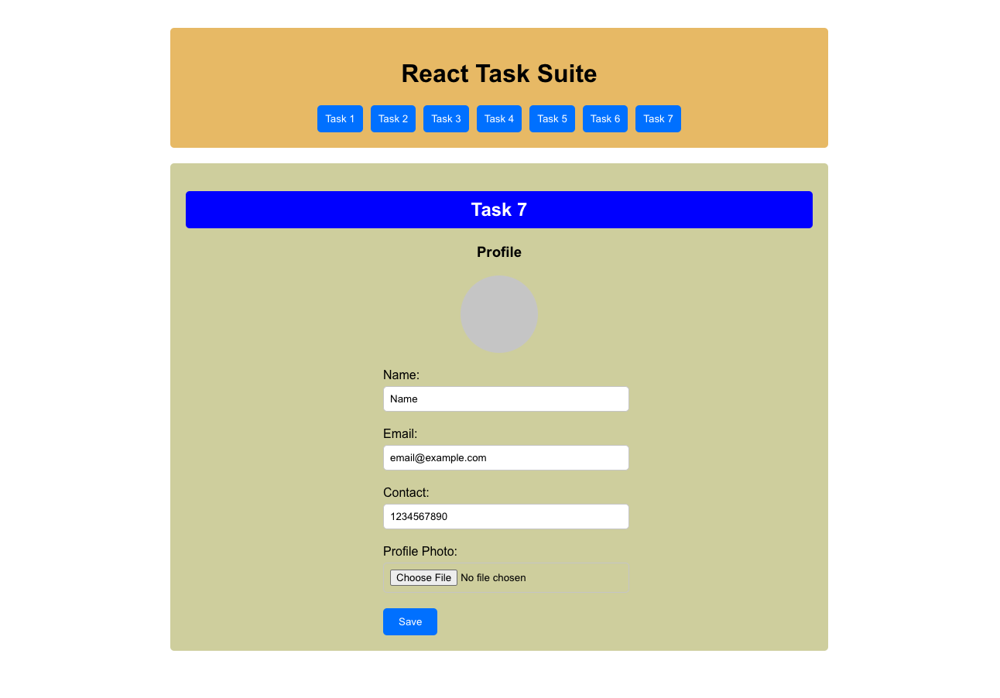

# React Task Suite

## Overview
React Task Suite is a collection of tasks implemented using React. This project showcases various functionalities and features that can be built using React, including counters, to-do lists, form validations, search functionality, image upload, fetching user details from an API, and creating a user profile page with editing capabilities.



## Table of Contents
- [Overview](#overview)
- [Features](#features)
- [Installation](#installation)
- [Usage](#usage)
- [Tasks](#tasks)
  - [Task 1: Counter](#task-1-counter)
  - [Task 2: To-Do List](#task-2-to-do-list)
  - [Task 3: Form Validation](#task-3-form-validation)
  - [Task 4: Search Functionality](#task-4-search-functionality)
  - [Task 5: Image Uploader](#task-5-image-uploader)
  - [Task 6: Fetch User Details](#task-6-fetch-user-details)
  - [Task 7: User Profile Page](#task-7-user-profile-page)
- [License](#license)

## Features
- **Counter**: A simple counter with increment and decrement functionality.
- **To-Do List**: A to-do list where users can add and remove items.
- **Form Validation**: A form with validation for name, email, contact, and password fields.
- **Search Functionality**: A product search that filters a list of products based on user input.
- **Image Uploader**: Allows users to upload and display images in a circular format.
- **Fetch User Details**: Fetches and displays user details from an API.
- **User Profile Page**: Displays and allows editing of user profile information, including uploading a profile picture.

## Installation
To install and run this project locally, follow these steps:

1. Clone the repository:
   ```bash
   git clone https://github.com/your-username/react-task-suite.git
   cd react-task-suite
   ```
2. Install the dependencies:
    ```bash
    npm install
    ```
3. Start the development server:
    ```bash
    npm start
    ```
The application will be available at http://localhost:3000.

## Usage
Navigate through the different tasks by clicking on the task buttons on the dashboard. Each task demonstrates a specific functionality implemented in React.

## Tasks

### Task 1: Counter
A simple counter that allows users to increment and decrement a number. The counter value cannot go below zero.

### Task 2: To-Do List
A to-do list where users can add items and remove them. The list of items is displayed below the input field.

### Task 3: Form Validation
A form with fields for name, email, contact, and password. The form validates the input fields based on specified criteria and enables the submit button only when all fields are valid. Upon submission, the entered values are displayed.

### Task 4: Search Functionality
A product search functionality that filters and displays products based on user input. The search is case-insensitive and updates the displayed products in real-time as the user types.

### Task 5: Image Uploader
Allows users to upload an image file and displays the uploaded image in a circular format.

### Task 6: Fetch User Details
Fetches user details from the API endpoint [JSONPlaceholder](https://jsonplaceholder.typicode.com/users) and displays them in a table format. The table includes columns for ID, name, email, and contact.

### Task 7: User Profile Page
Displays user profile information including name, email, and contact. Allows users to edit their profile information and upload a profile photo. The profile photo is displayed in a circular format.

## License
This project is licensed under the MIT License.
